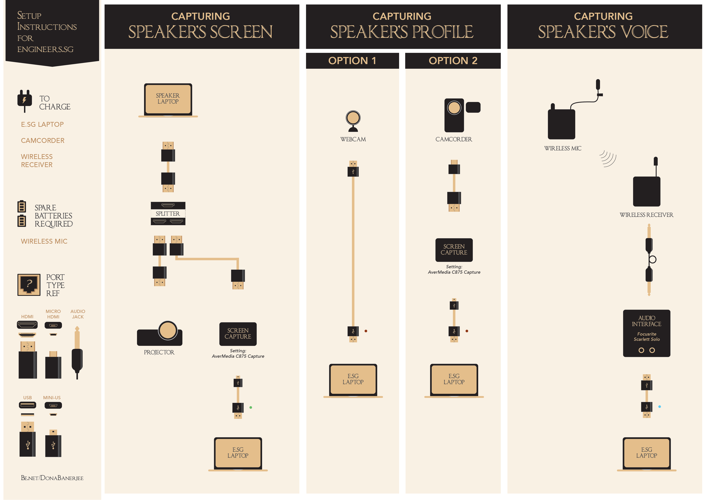

# Engineers.SG Recording Unit - Setup Guide Book

## Visual Guide

*Courtesy of Dona Banerjee ([@DonaBanerjee](https://github.com/DonaBanerjee))*

## Packing List

The recording unit's suitcase should consist of the following items:

- Laptop + charger
- Bag of HDMI cables (usually 2 cables)
- HDMI Adapters
	- VGA to HDMI
	- Display Port to HDMI
	- Mini Display Port to HDMI
	- USB-C to HDMI
	- HDMI to VGA
- Bag of video capture equipment
	- Logitech Webcam
	- USB extension cable
	- Sony Handycam (backup camera)
	- Charger for backup camera
	- Universal power plug adapter
- Bag of Audio gear
	- Wireless Lapel microphone (receiver)
	- Spare batteries
- Bag with Equipment Organizer (blue platform)
	- HDMI splitter + power adapter
	- Screen capture device (Avermedia Live Gamer Portable) + mini-USB cable (green dot)
	- Audio interface (Focusrite SCarlett Solo) + USB cable (blue dot)
	- Wireless microphone receiver + micro-USB cable + charger
- 2 camera stands 
	- Usually 1 tripod (for webcam) and 1 monopod (for the backup camera)
- Power Strip

## Setup Procedure

1. Find a suitable location to setup the recording equipment.
	- Take note of where the video cable for the projector is located
	- Take note of where the nearest power socket is located (relative to the video cable)
	- Does the venue have a table for you to place your equipment? If not, get a stable chair

2. Setup power strip

3. Setup the HDMI splitter + HDMI cables
	- This is so that presenter & organizers can check that their laptops are compatible with our setup as well as the projector's resolution
	- If its not realistic to keep the splitter on the equipment organizer, just remove it and position it near the speaker + video cable for the projector

4. 	Place the laptop (do not switch on yet) and connect the charger (start the power)
5. Setup the tripod + webcam
6. Setup the equipment organizer
	- Connect all the USB cables (blue, green & brown dot) to the laptop
	- Connect the micro USB charger to the wireless microphone receiver
	- Connect the HDMI cable to the screen capture device (if the splitter is not on the blue platform)
7. Setup the wireless microphone transmitter
	- Attach the lapel microphone
	- Switch on and check battery level (at the receiver)
	- The audio interface should also light up (green LED ring around the audio knob) when you speak into the microphone

8. Start the laptop & start OBS Studio
9. Check that you have a good capture
	- Ensure that you are getting video feed from the webcam, screen capture device (ensure a laptop is connected for presentation)
	- Ensure that you are getting a good audio feed from the wireless lapel microphone (green audio level bar should hover around 50-80% when presenter is speaking)
10. Try a test recording & verify that you can produce the video file